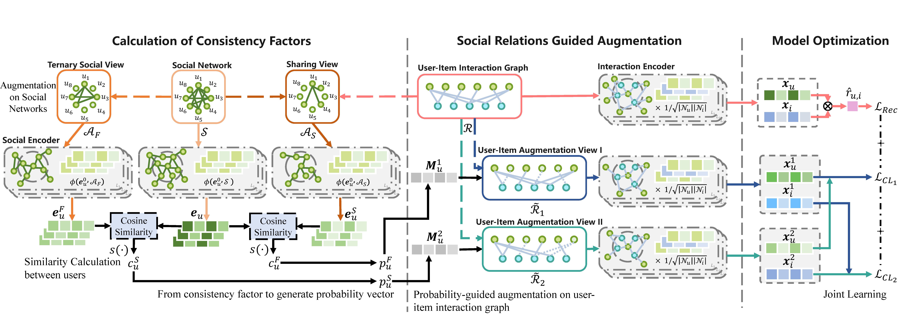

## Framework adopted

We sincerely thank for the robust support provided by the **SELFRec** framework for this project. 

**SELFRec** is a Python framework for self-supervised recommendation (SSR) which integrates commonly used datasets and metrics, and implements many state-of-the-art SSR models. SELFRec has a lightweight architecture and provides user-friendly interfaces. It can facilitate model implementation and evaluation.
**Founder and principal contributor**: [@Coder-Yu ](https://github.com/Coder-Yu) [@xiaxin1998](https://github.com/xiaxin1998) <br>
**Supported by**: [@AIhongzhi](https://github.com/AIhongzhi) (<a href="https://sites.google.com/view/hongzhi-yin/home">A/Prof. Hongzhi Yin</a>, UQ)

To learn more about the Self Rec framework, please visit https://github.com/Coder-Yu/SELFRec/.

## Architecture



## Requirements

```
numba==0.53.1
numpy==1.20.3
scipy==1.6.2
torch>=1.7.0
```

## Usage


<ol>
<li>Configure the xx.conf file in the directory named conf. (xx is the name of the model you want to run)</li>
<li>Run main.py and choose the model you want to run.</li>
</ol>

## Implemented Models

<table class="table table-hover table-bordered">
  <tr>
		<th>Model</th> 		<th>Paper</th>      <th>Type</th>   <th>Code</th>
   </tr>
   <tr>
    <td scope="row">DSVC</td>
        <td>Yang et al. <a href="https://cseweb.ucsd.edu/~jmcauley/pdfs/icdm18.pdf" target="_blank">Dual Social View Enhanced Contrastive Learning for Social Recommendation</a>, TCSS'24.
         </td> <td>Graph + CL</d> <td>PyTorch</d> 
      </tr>
   <tr>

## Related Datasets

| Datasets      | Yelp2018            | Douban-book         | FilmTrust           |
| ------------- | ------------------- | ------------------- | ------------------- |
| # User        | $45,919$            | $13,025$            | $1,509$             |
| # Item        | $45,538$            | $22,348$            | $2,072$             |
| # Interaction | $1,183,610$         | $598,420$           | $35,497$            |
| # Relation    | $709,459$           | $169,150$           | $1,853$             |
| U-I Density   | $5.66\times10^{-4}$ | $2.06\times10^{-3}$ | $1.14\times10^{-2}$ |
| U-U Density   | $8.01\times10^{-4}$ | $1.04\times10^{-3}$ | $1.92\times10^{-3}$ |

## Reference

If you find this repo helpful to your research, please cite our paper.
```
@article{yu2022self,
  title={Self-Supervised Learning for Recommender Systems: A Survey},
  author={Yu, Junliang and Yin, Hongzhi and Xia, Xin and Chen, Tong and Li, Jundong and Huang, Zi},
  journal={arXiv preprint arXiv:2203.15876},
  year={2022}
}
```
